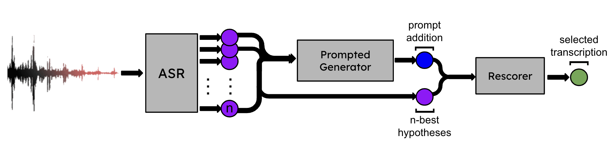

# ProGRes: Prompted Generative Rescoring for ASR n-Best

<h4>Big News !! ProGRes has been accepted to the IEEE Spoken Language Technology Workshop (SLT) !!!</h4>

This repository hosts the data and code files for our paper ProGRes: Prompted Generative Rescoring for ASR n-Best

<h3>Overview</h3>
Large Language Models (LLMs) have shown their ability to improve the performance of speech recognizers by effectively rescoring the n-best hypotheses generated during the beam search process. However, the best way to exploit recent generative instruction-tuned LLMs for hypothesis rescoring is still unclear. This paper proposes a novel method that uses instruction-tuned LLMs to dynamically expand the n-best speech recognition hypotheses with new hypotheses generated through appropriately-prompted LLMs. Specifically, we introduce a new zero-shot method for ASR n-best rescoring, which combines confidence scores, LLM sequence scoring, and prompt-based hypothesis generation. We compare Llama-3-Instruct, GPT-3.5 Turbo, and GPT-4 Turbo as prompt-based generators with Llama-3 as sequence scorer LLM. We evaluated our approach using different speech recognizers and observed significant relative improvement in the word error rate (WER) ranging from 5% to 25%.

<h3>Approach</h3>

The n-best hypotheses generated by the ASR are often noisy and sub-optimal. Many of these hypotheses rely solely on phonetic evidence and do not incorporate general knowledge, common sense, or deep linguistic insights. Our approach aims to improve the quality of the n-best hypotheses by using a secondary generative LLM. This intelligent model analyzes the n-best hypotheses and generates a more plausible transcription, that avoids non-existent tokens, words, named entities, etc. For each set of hypotheses, the LLM is prompted to predict the most plausible transcription. The LLM has the flexibility to either select an existing hypothesis or generate one entirely from scratch. The ASR n-best hypotheses and the LLM-generated hypothesis are concatenated to form an extended set of hypotheses.

The next step involves assigning a linguistic plausibility score to each hypothesis within the extended set. This score can be computed by employing an open-weight LLM to extract the pseudo-log-likelihood score for a sequence---a higher score indicates greater linguistic plausibility of the hypothesis.

For each hypothesis in the extended set, we also compute the ASR confidence score by evaluating the loss of the ASR model with the hypothesis treated as the target label; the ASR score depends on “how well” the hypothesis matches the acoustic evidence. The loss, which should be in the log-domain, can either be the Negative Log-Likelihood (NLL) or the Connectionist Temporal Classification (CTC) loss, or any other loss used to train the ASR model. Note that during training, the loss is normally minimized. Therefore, we need to negate it to get a score that is higher when the hypothesis matches the acoustic signal well. The ASR score can be computed for all hypotheses, including those generated by the LLM. We assign the confidence score of the best ASR hypothesis to the LLM-generated one. The LLM-generated hypothesis is more likely to be the best, and we observed that boosting it in this way helps improve performance.

To combine LLM and ASR scores, we use linear interpolation, as shown in the following equation: score = (1 − α) · ASRscore + α · LLMscore, where the hyperparameter α is introduced to adjust the ratio between the ASR and LLM scores. The optimal value of the language model weight α can be determined by performing a linear search optimization on the validation set. This step might involve testing values between 0 and 1 in increments of 0.05. The hypothesis with the highest score is selected as the output ASR transcription.
